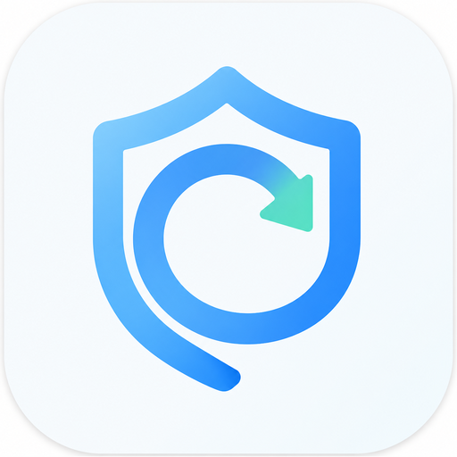

# CodexGuard



CodexGuard 是一个在本机运行的 Codex 桌面守护工具。它会监听所有 Codex 任务的本地记录；当某一轮明确因模型容量不足而停止，并且没有留下最终回复时，它会尝试在原任务中自动发起下一轮继续执行。

它不需要 OpenAI API Key，不上传任务内容，也不会操作键盘、鼠标、剪贴板或窗口。CodexGuard 是个人开发的非官方工具，与 OpenAI 没有关联。

> CodexGuard 使用 Tauri 2。macOS 已实现自动继续；Windows 目前只支持状态监听，尚未开放自动发送。

## 主要功能

- 增量监听 `~/.codex/sessions` 下的全部 Codex 任务记录。
- 只处理明确的模型容量错误，不干预普通失败。
- 先确认失败轮次没有最终回复，再决定是否继续，避免重复打扰已经完成的任务。
- 根据任务 ID 把继续消息发回原任务，不依赖当前窗口或任务标题猜测目标。
- 显示整体守护状态、最近任务、任务名称、最后活动时间和需要人工处理的情况。
- 可随时暂停或恢复自动继续；暂停后仍会保留监听。
- 使用彩色托盘图标提示正常、需要留意和需要处理三种状态。
- 主窗口关闭后继续在托盘运行，可通过托盘重新打开或彻底退出。
- 保存去重记录和连续自动继续次数，应用重启后不会重复处理同一条错误。
- 提供本地运行日志，并可在主界面中直接打开。

## 平台支持

| 平台 | 任务监听与界面 | 自动继续 | 当前说明 |
| --- | --- | --- | --- |
| macOS | 支持 | 支持 | 使用 Codex 桌面端的本地消息通道 |
| Windows | 共用逻辑已实现，待实机验收 | 暂不支持 | 通道确认前只监听并提示人工继续 |
| Linux / WSL2 | 未正式适配 | 暂不支持 | 不属于当前发布目标 |

自动继续依赖 Codex 桌面端正在运行，并且本地消息通道可用。通道不存在、协议发生变化、找不到原任务或没有收到明确回执时，CodexGuard 会停止自动处理该事件并提示人工继续。

## 判断规则

CodexGuard 只在读取到完整的 `task_complete` 记录后作出判断，不会根据生成中的文字提前操作。

| 记录情况 | 处理方式 |
| --- | --- |
| 明确是容量错误，且 `last_agent_message` 为空 | 进入待继续；开关已开启且通道可用时自动继续 |
| 明确是容量错误，但已经有最终回复 | 标记为已有回复，不发送消息 |
| 明确是容量错误，但缺少判断所需字段 | 标记为需要确认，不自动发送 |
| 普通网络、权限或业务错误 | 忽略，不干预 |
| 错误后用户已经手动开始新一轮 | 取消旧事件，不再重复发送 |

为避免循环和误触发，程序还会执行以下保护：

- 使用“任务 ID + 失败轮次 ID”去重。
- 只有收到包含新轮次 ID 的成功回执，才认为继续消息发送成功。
- 同一任务连续自动继续达到 10 次后转为人工处理。
- 用户手动发送新消息后，清空该任务的连续计数。
- 启动时只补查最近 10 分钟内更新的任务记录，不扫描并处理很久以前的失败。
- 发送失败时不会改用命令行或界面自动化再次尝试。

## 界面与托盘状态

主界面每 3 秒刷新一次，最多展示最近 100 个已识别任务。任务可能显示为运行中、待继续、已有回复、空闲、需确认或通道不可用。任务可以从最近列表中手动移除；这不会删除 Codex 会话，有新活动时它会再次出现。

托盘和主界面的颜色含义一致：

- 绿色：监听和消息通道正常，没有待处理异常。
- 黄色：自动继续已暂停、消息通道未就绪，或有任务正在等待处理。
- 红色：监听失败，或有任务需要人工确认、人工继续。

点击主界面的“查看日志”可以用系统默认应用打开日志文件。关闭主窗口只会隐藏窗口；如需完全退出，请使用托盘菜单中的“退出”。

## 本地运行

### 准备环境

- Rust 1.77 或更高版本
- Node.js 20 或更高版本
- pnpm 10
- 对应平台的 Tauri 构建环境

macOS 自动继续还需要 Codex 桌面端保持运行。

### 启动开发版

```sh
pnpm install
pnpm tauri dev
```

自动继续默认开启。启动开发版后，如果发现符合条件的新容量错误，macOS 上可能会真实发送继续消息。调试时请先确认主界面中的开关状态。

### 检查与测试

检查前端：

```sh
pnpm build
```

测试并检查 Rust 后端：

```sh
cd src-tauri
cargo test --all-targets
cargo check --all-targets
```

### 构建安装包

回到项目根目录后运行：

```sh
pnpm tauri build
```

只构建调试可执行文件、不生成安装包：

```sh
pnpm tauri build --debug --no-bundle
```

## 本地数据与隐私

Codex 任务目录优先取自 `CODEX_HOME`。未设置时使用 `~/.codex`：

```text
任务记录：~/.codex/sessions
macOS 消息通道：~/.codex/ipc/ipc.sock
```

如果设置了 `CODEX_HOME`，以上两个位置会相应变为 `$CODEX_HOME/sessions` 和 `$CODEX_HOME/ipc/ipc.sock`。

应用状态、设置和日志统一保存在 CodexGuard 的本地数据目录：

| 平台 | 本地数据目录 |
| --- | --- |
| macOS | `~/Library/Application Support/CodexGuard` |
| Windows | `%LOCALAPPDATA%\CodexGuard` |

目录中的 `state.json` 保存去重与连续计数，`config.json` 保存设置，`codexguard.log` 保存运行日志。

所有判断都在本机完成。状态文件不保存任务正文；日志只记录任务 ID、轮次 ID、关键自动继续结果和异常。
正常监听状态以主界面和托盘为准，日志不会再周期性写入心跳记录。
运行日志超过 5 MB 后会自动换成新文件，并保留一份 `.1` 结尾的旧日志，避免长期运行时无限增长。

## 安全边界

当前 Tauri 主版本明确不会：

- 调用 `codex exec resume` 或启动其他 Codex CLI 子进程。
- 申请 macOS 辅助功能权限。
- 模拟键盘、鼠标、焦点、剪贴板或窗口操作。
- 根据任务标题或当前前台窗口猜测发送目标。
- 在本地消息通道失败后切换到其他发送方式。
- 自动更换模型、账号，或处理容量不足以外的错误。

## 项目结构

```text
CodexGuard/
├── src/
│   ├── main.ts                     # 主界面、状态刷新和交互
│   ├── i18n.ts                     # 界面文案与语言切换
│   └── styles.css                  # 界面样式
├── src-tauri/
│   ├── src/core/                   # 错误判断、任务状态和去重策略
│   ├── src/watcher/                # JSONL 任务记录的增量监听
│   ├── src/transport/              # 按任务 ID 发送继续消息
│   ├── src/service.rs              # 守护流程和连续保护
│   ├── src/storage.rs              # 设置、状态和日志
│   └── tauri.conf.json             # 桌面应用与打包配置
├── ARCHITECTURE.md                  # 当前架构与安全边界
├── LICENSE                          # MIT 开源许可证
└── README.md
```

## 当前限制

- 依赖 Codex 当前的本地任务记录格式；格式变化后可能需要同步更新解析规则。
- macOS 自动继续使用的是本地版本化通道，并非公开稳定接口；Codex 更新后可能暂时不可用。
- Windows 尚未接入可以按任务 ID 定向发送并返回明确回执的本地通道。
- 当前只处理模型容量不足，不会自动处理其他错误，也不会自动切换模型。
- 启动时只补查最近 10 分钟的记录；更早的历史错误不会自动处理。
- 当前仓库仍处于开发验证阶段，尚未提供正式签名的公开安装包。

更完整的设计背景和安全边界见 [ARCHITECTURE.md](ARCHITECTURE.md)。

## 开源许可

CodexGuard 基于 [MIT License](LICENSE) 开源。你可以自由使用、修改和分发，但需要保留许可证中的版权和许可声明。
